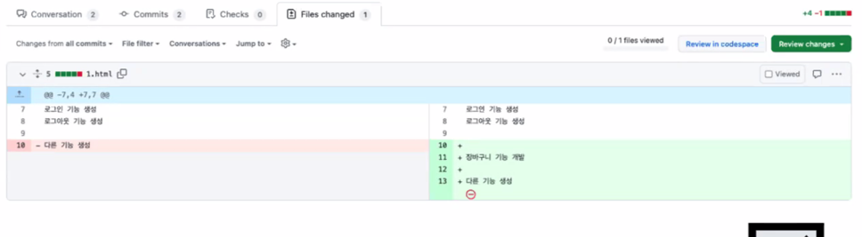
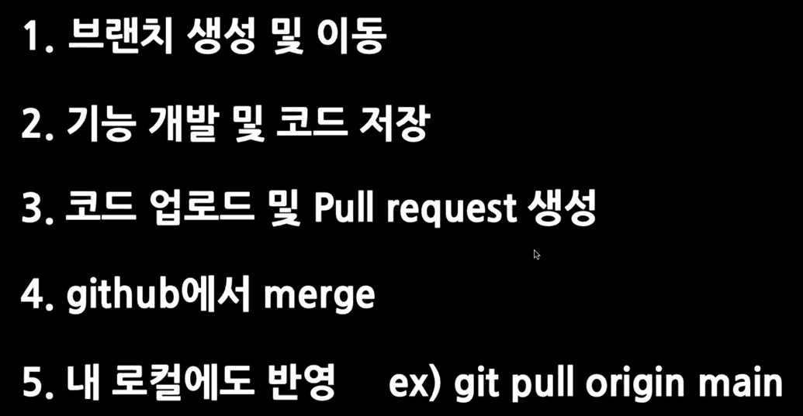
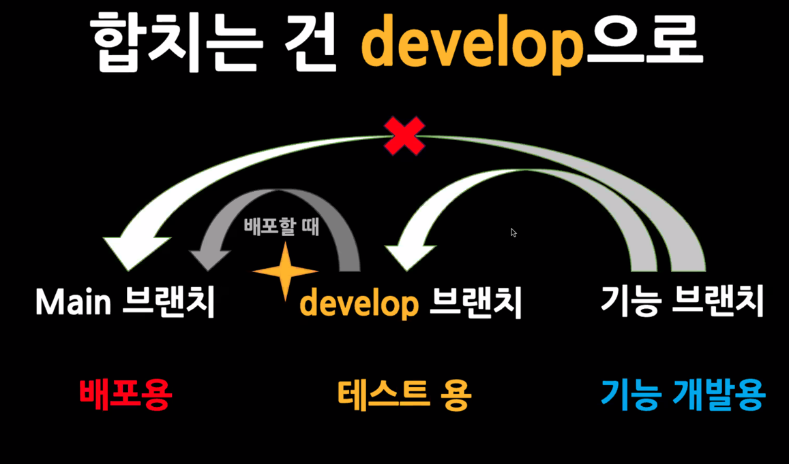
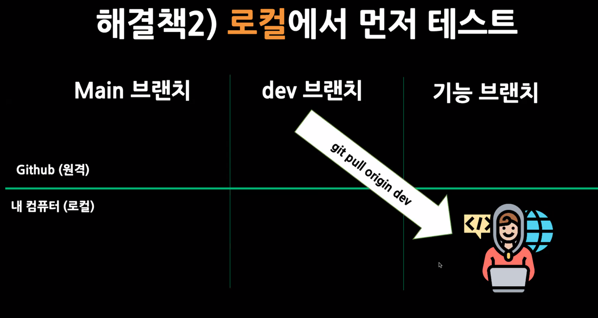
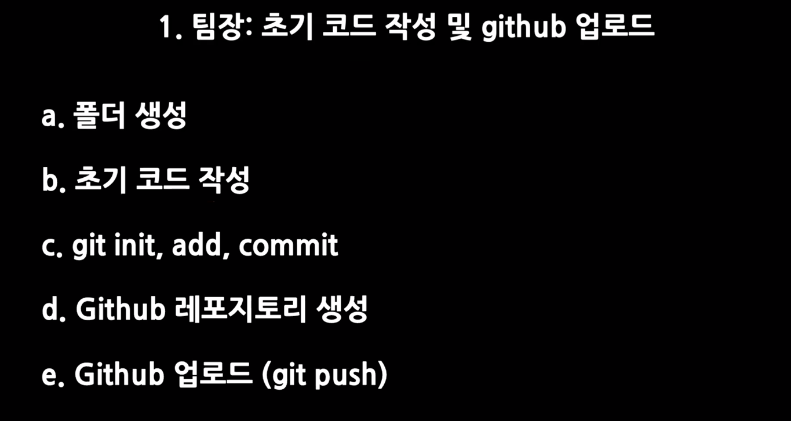
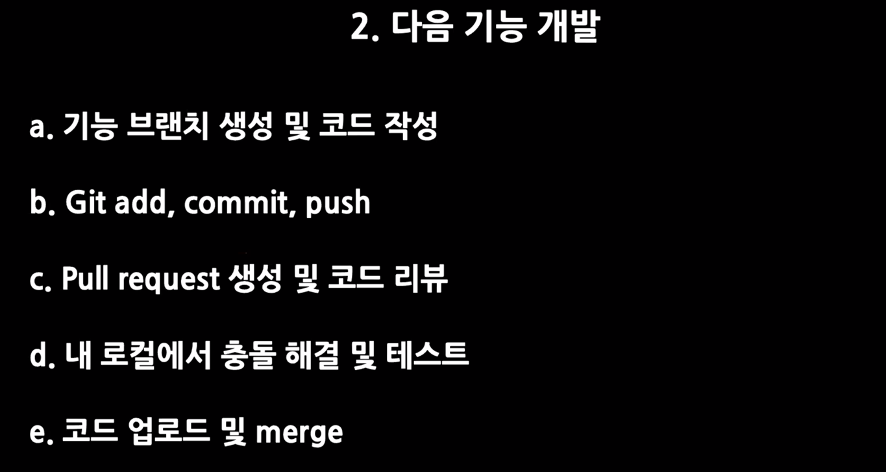
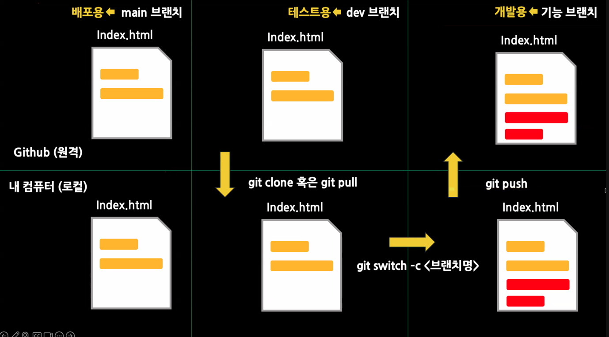
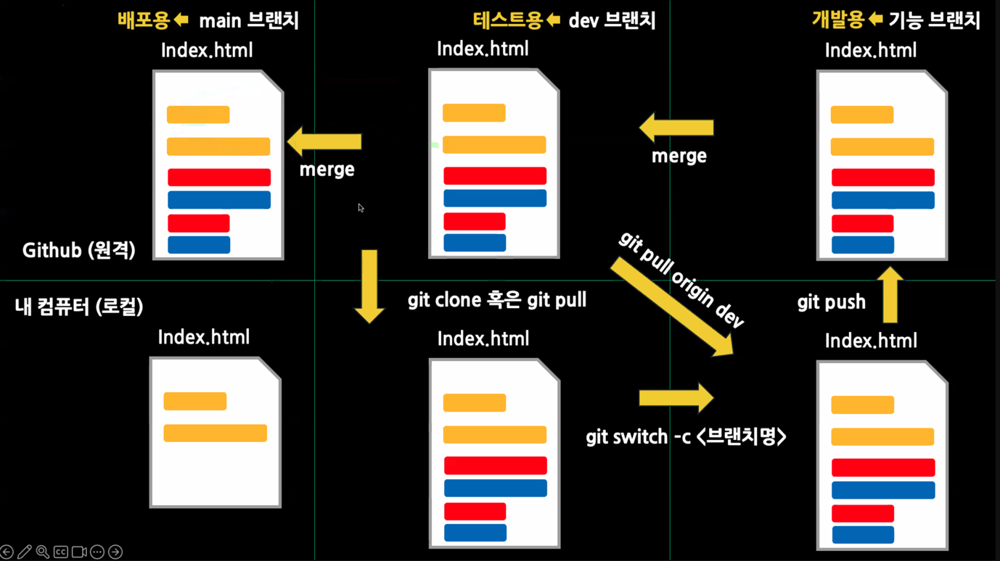
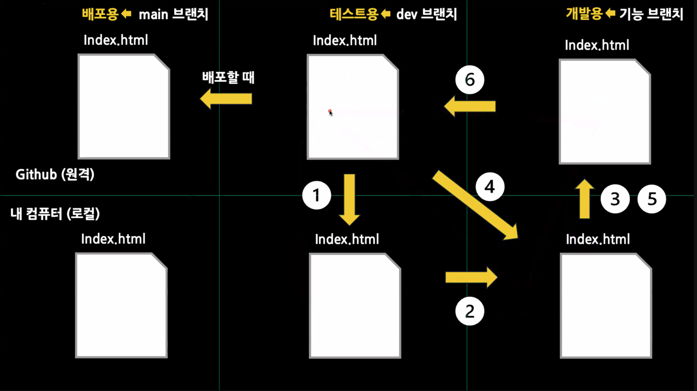

# nbCamp
내일 배움 캠프에서의 활동을 기록할 것 입니다.

## Git & Github로 협업하는 방법

> 연습용으로 조금 연습하고, 하면 익숙해 질 수 있다! **해보자!!**

### 브랜치 활용하기
- 수정은 하고 싶은데 원래 파일을 놔두고 싶을 때 
  - 일일히 복사를 할 수 없다. 이를 위해서 복사와 비슷한 개념인 브랜치에 대해서 알아보겠습니다.
  - `git branch BranchName` 을 통해서 새로은 branch를 생성할 수 있습니다.
    - 이렇게 만들면 아무것도 표시가 나오지 않는다. 이때, `git branch`를 입력하면 내가 만든 것들을 볼 수 있습니다.
    - 다른 색으로 보이는 것 or `*`로 적혀있는 것이 현재 내가 있는 브랜치 입니다. -> 나가는 것은 `q`로 나갑니다.
  - `git switch BranchName` / `git checkout BranchName` 을 통해서 BranchName이라는 곳으로 이동 할 수 있습니다.
    - 위의 `switch`, `checkout`은 원래 **checkOut**은 기존에 있던 것입니다. 근데 현재에는 **switch**가 생겨서 이것을 통해서 옮겨 갑니다.
    - 또한 `checkout`은 과거의 코드로 회귀하는 역할이 있기에 완전히 `switch`를 사용합니다.
  - 이렇게 생성과 이동이 따로가 아닌 생성 후 바로 이동하는 것은 아래처럼 작성할 수 있습니다.
    - `git switch -c BranchName` / `git checkout -b BranchName`

### 브랜치에서 코드를 수정해봅시다!

결론은 바뀌지 않습니다. 이렇게 따로 구현한 기능에 대해서 합쳐야 합니다. 그 이유는 팀원이 같이 공유하고 개발하는 것이 main 이기 때문에 Main으로 모아주어야 합니다.
> `git merge TeamBranchName`
> 으로 따로 개발한 내역을 팀 브랜치로 복사하여 공유를 하는 것 입니다.

하지만, 위의 코드를 잘 사용하지 않습니다. 합치는 작업은 github에서 합쳐야 합니다. 

그 이유는 아래와 같습니다.
**충돌지점을 찾아주고, 코드리뷰에 용이하게 합니다.**

#### 그러면 어떻게 합칠까?
`pull request`를 통해서 진행을 합니다. -> 당겨서 합치는 것을 요청하는 것이라고 직역해서 알아볼 수 있습니다. 하는 방식은 아래의 사진과 같습니다.

> `git push origin login` -> `git switch main` -> `git pull origin main`

단, main 브랜치는 배포용입니다. 이때, 위의 방법처럼 무분별하게 합치는 경우에는 배포에 오류가 발생할 수 있습니다. 구상한 기능들이 다 완성되지 않았는데, 하나만 완성되었다고 올리면 사전에 배포가 되기 때문에 문제가 될 수 있습니다.

또한, 다 만들고 분석을 하는데 main으로 그때 그때 합치게 되면 리펫토링을 진행할때 시간이 많이 걸린다는 단점이 있습니다. 그래서, **우리는 develop branch를 만듭니다.**

- 여기서, 그냥 합치게 되면 변경한 내용이 겹치면서 이상한 오류가 발생할 수 있습니다. 이러한 문제를 해결하기 위해서, 우선적으로 내 컴퓨터에서 테스트를 해보며 확인을 하는 게 좋습니다.

그러면 이제, 각 팀원과 팀장이 해야 할 역할과 정말 실제 개발에 있어서 사용하는 전체적인 과정을 보여드리겠습니다.

## Conclusion

