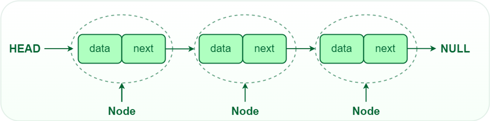
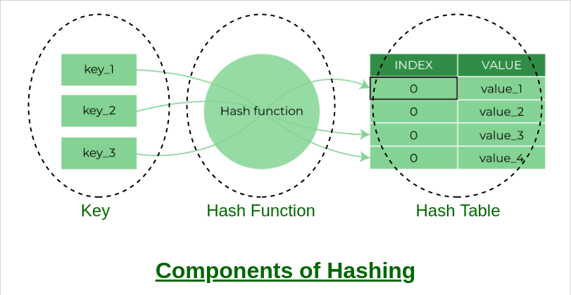
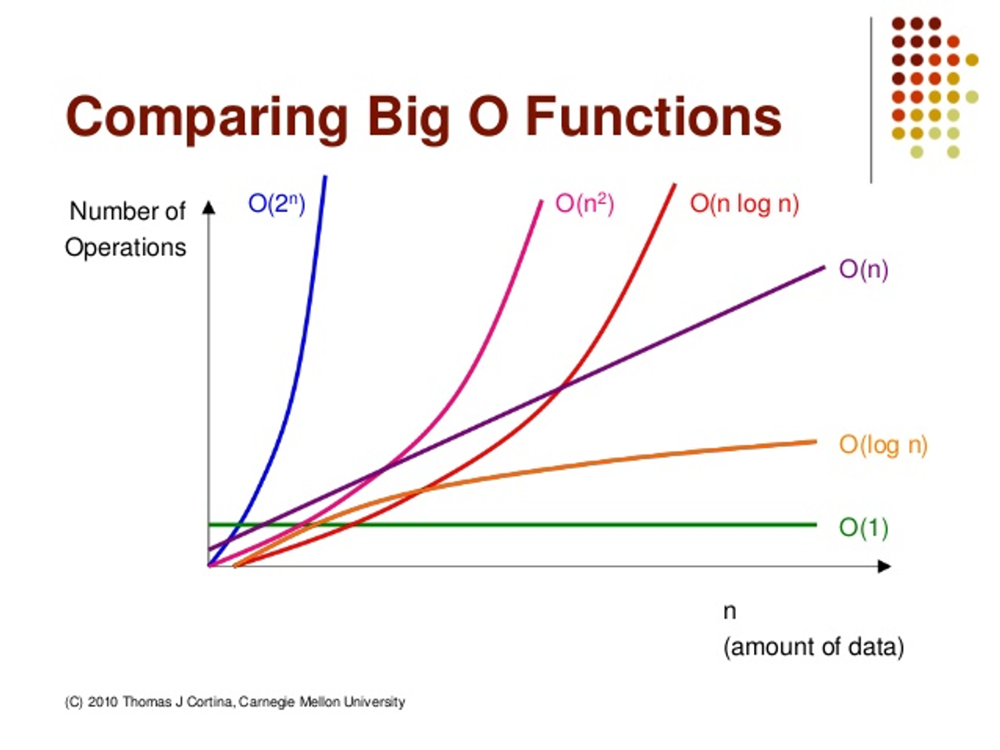
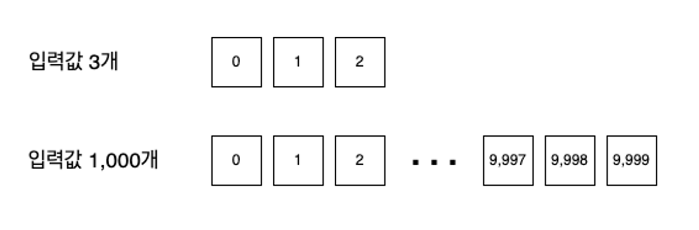

# Algorithm ⏰

## 1. 알고리즘의 필요성
- 개발자 관점
  - 복잡한 문제를 효율적이고 효과적으로 해결합니다. 
  - 문제 풀이의 과정을 더 안전하고, 빠르고, 수행하기 쉽도록 도와줍니다.
- 취준생의 관점
  - 기본적으로 입사를 하기 위해서 **코테**를 많이 이용한다...
  - 그리고 업무에서 기본적인 알고리즘 활용이 생각보다 많이 쓰인다.

--- 

## 2. 자료구조
- 개발적 관점
  - 효율적인 데이터 관리 : 데이터의 효율적인 저장과 검색을 가능하게 하여 처리 시간을 줄이고 성능을 향상시킵니다.
  - 데이터 조직
  - 데이터 추상화
  - 재사용성
  - 알고리즘 최적화
- 취준생 관점
  - 알고리즘/자료구조를 알면 실전 문제를 빠르게 길을 찾고 풀 수 있습니다!

1. Array
2. LinkedList
- 각 노드가 다음 순서의 노드를 연결한 형태의 자료 구조입니다.
  
3. Hash Table
- 이는, DB에서 사용되는 방식의 자료구조로 키를 입력 받고, 크 키에 알맞는 인덱스를 알려줍니다. 해당 방법으로 빠르게 키를 인덱스와 매핑해 줍니다.

4. Graph
- 각 노드들이 그물망처럼 간선으로 연결된 자료구조 입니다.

5. Stack & 
- FILO(`push()` , `pop()`)

- FIFO(`enqueue() : data input` , `dequeu() : data print`)

6. Tree
- 말 그대로 트리 형태로 이뤄진 자료구조입니다.
  - 각 노드가 부모-자식 관계처럼 간선으로 연결된 노르를 가질 수 있습니다.
  - 트리의 꼭대기는 root 노드이며, 자식을 가지지 않는 노드는 leaf 노드입니다.

> **Images References**
> 1. https://www.geeksforgeeks.org/what-is-linked-list/
> 2. https://www.geeksforgeeks.org/implementation-of-hash-table-in-python-using-separate-chaining/
> 3. https://www.geeksforgeeks.org/implementation-of-hash-table-in-python-using-separate-chaining/
> 4. https://www.geeksforgeeks.org/stack-data-structure/
> 5. https://www.geeksforgeeks.org/introduction-to-queue-data-structure-and-algorithm-tutorials/
> 6. https://www.geeksforgeeks.org/introduction-to-tree-data-structure-and-algorithm-tutorials/

---
## 자료구조를 직접 구현해보자!