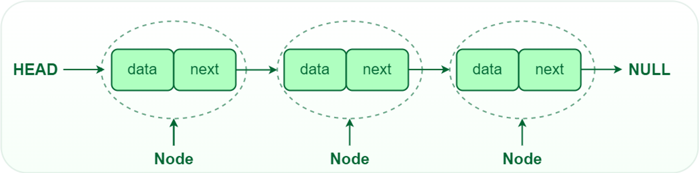
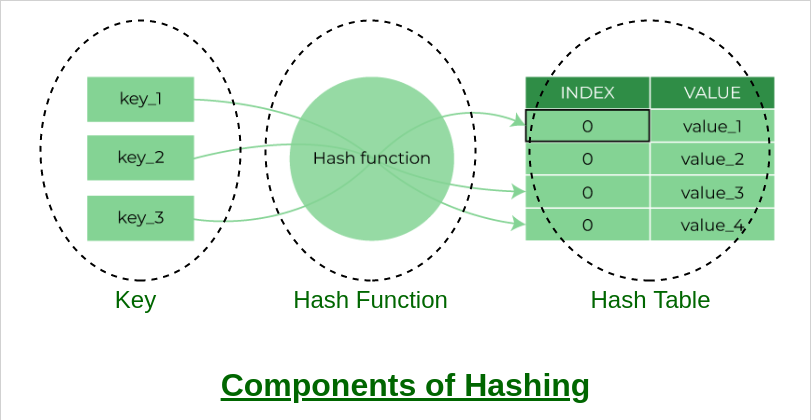
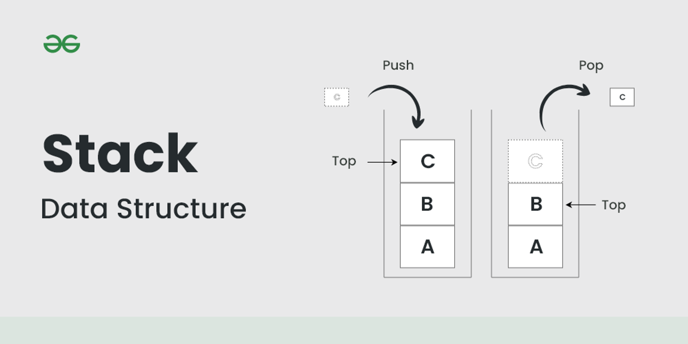
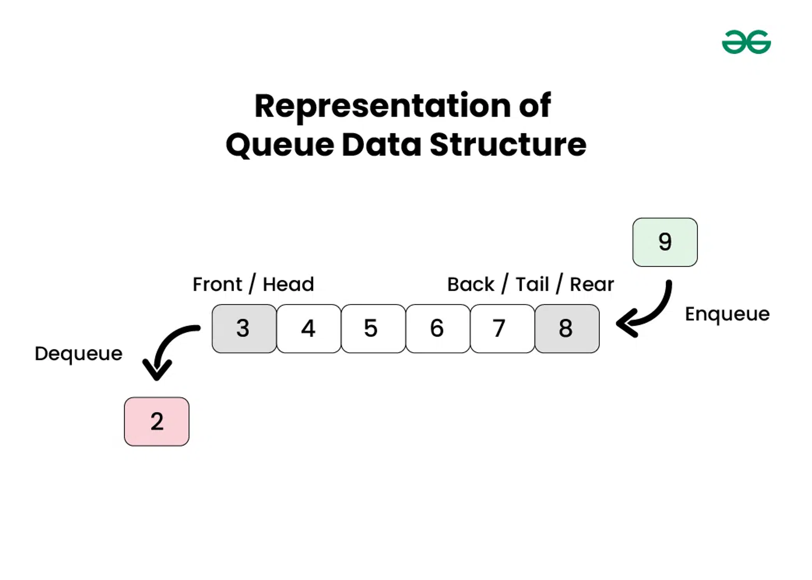
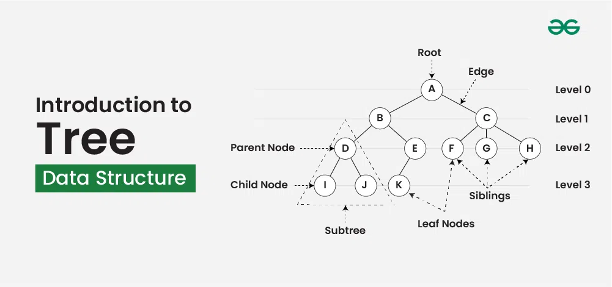
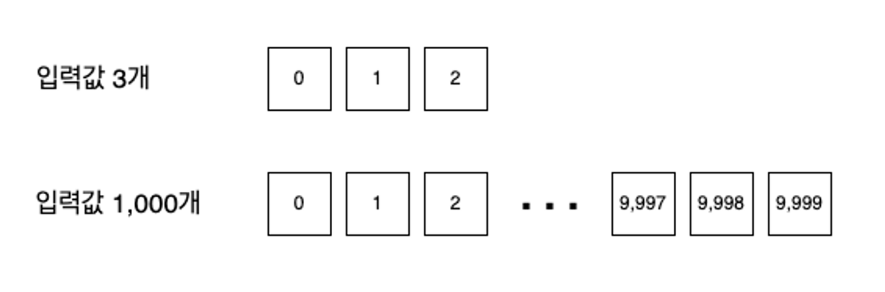
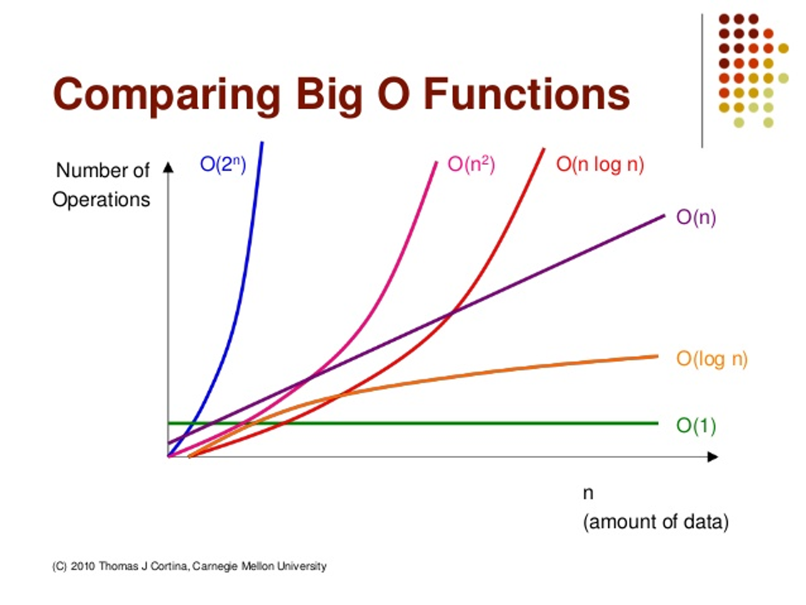

# Algorithm ⏰

## 1. 알고리즘의 필요성
- 개발자 관점
  - 복잡한 문제를 효율적이고 효과적으로 해결합니다. 
  - 문제 풀이의 과정을 더 안전하고, 빠르고, 수행하기 쉽도록 도와줍니다.
- 취준생의 관점
  - 기본적으로 입사를 하기 위해서 **코테**를 많이 이용한다...
  - 그리고 업무에서 기본적인 알고리즘 활용이 생각보다 많이 쓰인다.

--- 

## 2. 자료구조
- 개발적 관점
  - 효율적인 데이터 관리 : 데이터의 효율적인 저장과 검색을 가능하게 하여 처리 시간을 줄이고 성능을 향상시킵니다.
  - 데이터 조직
  - 데이터 추상화
  - 재사용성
  - 알고리즘 최적화
- 취준생 관점
  - 알고리즘/자료구조를 알면 실전 문제를 빠르게 길을 찾고 풀 수 있습니다!


1. Array
2. LinkedList
- 각 노드가 다음 순서의 노드를 연결한 형태의 자료 구조입니다.
  
3. Hash Table
- 이는, DB에서 사용되는 방식의 자료구조로 키를 입력 받고, 크 키에 알맞는 인덱스를 알려줍니다. 해당 방법으로 빠르게 키를 인덱스와 매핑해 줍니다.

4. Graph
- 각 노드들이 그물망처럼 간선으로 연결된 자료구조 입니다.

5. Stack & 
- FILO(`push()` , `pop()`)

- FIFO(`enqueue() : data input` , `dequeu() : data print`)

6. Tree
- 말 그대로 트리 형태로 이뤄진 자료구조입니다.
  - 각 노드가 부모-자식 관계처럼 간선으로 연결된 노르를 가질 수 있습니다.
  - 트리의 꼭대기는 root 노드이며, 자식을 가지지 않는 노드는 leaf 노드입니다.



---

# 알고리즘 심화

>**1. 알고리즘에 대해서**

알고리즘은 어떤 작업을 수행하기 위해 입력을 받아서 원하는 출력을 만들어내는 과정을 기술 한 것 입니다.

위의 알고리즘의 효율성과 작업 시간을 표현하기 위해서 나온 개념이 **시간복잡도**라고 합니다. 또한, **의사코드**는 Pseudo-code로 컴퓨터 프로그래밍이나 알고리즘이 수행해야 할 내용을 논리적으로 서술해 놓은 것입니다.

> 2. 알고리즘 예시

- 실제 코드 예시
```java
import java.util.Scanner;

public static void main(String[] args) {
  Scanner scanner = new Scanner(System.in);
  int[] scoreBox = new int[100];
  int maxScore = 0; 
  
  for(int i = 0; i < 100; i++){
      int score = scanner.nextInt();
      maxScore = Math.max(score, maxScore);
      
      scoreBox[i] = score; 
  }

  System.out.println(maxScore);
}
```

- Psuedo-code 예시(maxValue 찾기)
```textmate
// 1차원 배열을 입력으로 받는다.
maxScore(scoreBox[]){
    // 최댓값을 초기화
    max <- 0;
    
    // 배열의 요소 갯수만큼 반복한다.
    for(i = 0; i < scoreBox.length; i++) do {
            // 해당 배열의 요소 값이 최댓값보다 크거나 같다면
            if(scoreBox[i] >= max) then{
                // 해당 값을 최댓값으로 지정한다.
                max <- scoreBox[i];
            }
        }
    }
}
```

- 모든 요소 곱하고 더하기
```textmate
multiplyAllElements(a[])
{
	sum <- 0;
	
	for (i <- 0; i < a.length-1; i <- i+1) do { 
		for (j <- 0; j < a.length-1; j <- j+1) do {
			sum <- sum + a[i] * a[j];
        }
	}
	
	return sum;
}
```

## Time Complexity
`시간 복잡도`라는 것은 알고리즘이 문제를 얼마나 빠르게 해결했는지 평가하는 지표로 사용하는 것이 시간입니다. 이때, 소요시간과 입력값의 상관 관계를 표한하는 것입니다.


- **Big-O 표기법**
Big-O notation은 알고리즘의 입력의 크기가 n이면, n^2에 비례하는 시간이 소요된다는 것을 의미합니다.


> **O(1) < O( 𝑙𝑜𝑔𝑛 ) < O(n) < O(n 𝑙𝑜𝑔𝑛 ) < O( 𝑛2 ) < O( 2𝑛 ) < O(n!)**

위 같은 시간 복잡도는 수치를 단순화해서 단순하게 경향성을 보기 때문에 위 같은 방법으로 비교를 합니다!


> **Images References**
> 1. https://www.geeksforgeeks.org/what-is-linked-list/
> 2. https://www.geeksforgeeks.org/implementation-of-hash-table-in-python-using-separate-chaining/
> 3. https://www.geeksforgeeks.org/implementation-of-hash-table-in-python-using-separate-chaining/
> 4. https://www.geeksforgeeks.org/stack-data-structure/
> 5. https://www.geeksforgeeks.org/introduction-to-queue-data-structure-and-algorithm-tutorials/
> 6. https://www.geeksforgeeks.org/introduction-to-tree-data-structure-and-algorithm-tutorials/
> 7. http://devwebcl.blogspot.com/2016/12/big-o-comparison.html