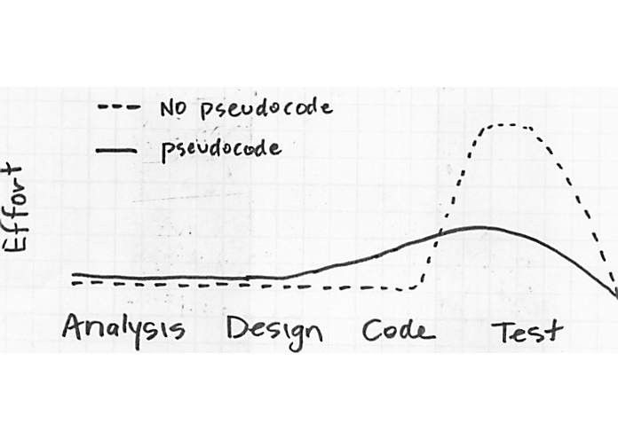

# Pseudo Code

안녕하세요! 오늘은 Code-Kata 시간에 알고리즘 심화 과정을 배우면서, 의사코드라는 것을 접하게 되었습니다. 

이것이 우리의 코드의 간단한 형태 즉, 로직은 진짜 코드가 아닌 대강 표현하는 방식을 말하는데요 저는 `Sudo` 이런 키워드를 Terminal 에서 어떤 명령어를 강제로 실행해야 할 경우에만 접해본 것 같아서 본격적으로 공부하며 알아볼 계획입니다.

**Pseudo(가짜의)-Code**, 의사코드란, 프로그램 코드를 작성할 때 사용하기 위해, 프로그램의 진행 과정을 단계별로 기록해 놓은 것을 말합니다.

## 의사코드를 왜 사용할까?
- 나중에 프로그램 코드를 읽고 디버깅을 하거나 내용을 수정해야 하는 개발자에게 도움을 줄 수 있습니다.
- 컴퓨터 프로그램 알고리즘이 어떻게 실행되어야 할지, 또는 어떻게 실행 될 수 있을지 보여줄 수 있습니다.
- 나중에 코드입력, 테스트, 디버그 수정 단계에서 작업하는 것보다 의사코드 설계 단계에서 미리 오류를 수정하는 것이 훨씬 경제적입니다 
- 프로그램의 문제를 해결하기 위한 도구로, 또는 다른 사람들과 프로그램의 흐름에 대해 소통하기 위한 방법으로 활용됩니다.


(출처 : https://sujinlee.me/pseudocode/)

## 어떻게 의사코드를 작성할까?
의사코드가 뭔지 그리고 왜 사용하는지 알아보았습니다. 그러면 어떻게? 작성하는지도 알아보겠습니다!

우선, 의사코드를 작성할때 **반드시 따라야 하는 규칙은 없습니다.** 하지만, 다른 개발자들이 쉽게 이해할 수 있는 형식을 사용해야 이해가 편하겠죠? 

방금 규칙이 없다고 했지만, 우리가 알고 있어야 하는 규칙은 존재합니다.
1. 순차적 명령문
```text
1. 상품포장()
2. 영수증 발행()
3. 상품 발송()
```
2. 반복문
`while`문을 사용했을 경우 시작할 때 while을 적고 끝날떄 endwhile을 적어줍니다.

```text
while 인구 < 한계
    최신 인구 = 과거 인구 + 출생자 수 - 사망자 수
endwhile
```
`for statement` 같은 경우는 `for i = number to number2 do statement()`의 형식으로 작성합니다.
```text
for i = 0 to inputNumber do
    sum = sum + i
endfor
```
3. 조건문
```text
if 업무 시간 > 평균 근무 시간 then
    초과 근무 메시지를 표시한다.
else
    일반적인 근무 메시지를 표시한다.
endif
```
각 문법을 살펴봤으니 실전 예제로 가보겠습니다.

1. 
```text
파일을 연다.
사용자에게 바꾸고 싶은 단어가 무엇인지 물어 본다.
그리고 그 단어를 어떤 단어로 바꾸고 싶은지 물어 본다.
   파일의 각 행(line)에 대해서
       단어를 찾기 위해 다음과 같은 과정을 진행한다.
           각 글자를 읽어 들인다.
           글자가 바꾸고 싶은 단어의 첫 글자와 일치하면,
           끝까지 일치하는지 확인해 본 후
           일치한다면, 단어를 찾은 것이다.
       그 단어가 몇 번 나왔는지 센다.
       이제 그 단어에 해당하는 글자들을 지운다.
       그리고 그 자리에 새로운 단어에 해당하는 글자들을 채워 넣는다.
       단어를 몇 번 바꾸어 주었는지 사용자에게 알려준다.
파일을 닫는다.
```

2.  한 줄에 한개의 명령만 입력하자!
```text
할 일 목록:
    이름, 시급, 업무 시간, 공제율(deduction rate)을 확인한다.
    계산을 한다.
    임금 = 시급 * 업무 시간
    공제 = 임금 * 공제율
    최종 임금 = 임금 - 공제
    이름, 임금, 공제, 최종 임금을 작성한다.

의사코드:
    이름, 시급, 업무 시간, 공제율(deduction rate)을 확인한다.
    계산한다.
        임금 = 시급 * 업무 시간
        공제 = 임금 * 공제율
        최종 임금 = 임금 - 공제
    이름, 임금, 공제, 최종 임금을 파일에 저장한다.
```
3. 영어로 입력하는 방법!
```text
입력(Input): READ, OBTAIN, GET 
출력(Output): PRINT, DISPLAY, SHOW 
계산(Compute): COMPUTE, CALCULATE, DETERMINE 
초기화(Initialize): SET, INIT 
요소를 추가(Add one): INCREMENT, BUMP 
선형적으로 증가할 때(linear progression): SEQUENCE 
반복: WHILE, FOR 조건문: IF-THEN-ELSE 
마지막에 조건문이 있는 반복문: REPEAT-UNTIL IF-THEN-ELSE 
대신 조건 분기처리: CASE 
부울 : TRUE / FALSE 
그외 : REPEAT - UNTIL RETURN BEGIN / EXCEPTION / END 
```
4. 주의 할 점! 이렇게 작성하면 안됩니다.
```text
g=54/r이라고 하자.
(이유: 변수를 쓰지 말고, 각 변수의 실제 의미를 적어 주자.)
다 될 때까지 주요 과정을 반복한다.
(이유: "주요 과정"이 뭔지, "다 되는 것"이 뭔지 명확하게 해야 한다.)
```

## 실습해봅시다!

- Calculator 예제
```text
계산기

Main:
    선택하고 싶은 모드를 고르게 한다(circle/rect)
    String mode = scanner.nextLine();으로 받음
    원의 경우 반지름 입력 받는다.
    모드와 변수를 파라미터로 받는 클래스의 객체(Calculator라고 명명)를 생성한다.
    
    사각형의 경우 각 변의 길이를 double의 형식으로 받는다.
    연산자를 입력 받는다.
    모드와 변수를 파라미터로 받는 클래스의 객체(Calculator라고 명명)를 생성한다.
    
    remove/inquiry/exit 중 선택하게 한다. nextLine()
    Calculator의 선택 입력값 주입
Calculator:
    Calculator 내부에 circle/rect 객체를 선언한다.(의존성 주입)
    Calculator의 생성자를 만든다.
    Circle 계산하는 객체 주입
    변수 
    Rect 계산하는 객체 주입 
    
    원 계산 결과 출력 및 저장
    사각형 계산 결과 출력 및 저장
    
    프로세스 세터 설정
    프로세스에 대한 서비스 구현 
```

이런 식으로 진행해봤습니다! 이상으로 오늘 치 TIL은 마치겠습니다.

> **References**
> 1. https://sujinlee.me/pseudocode/)