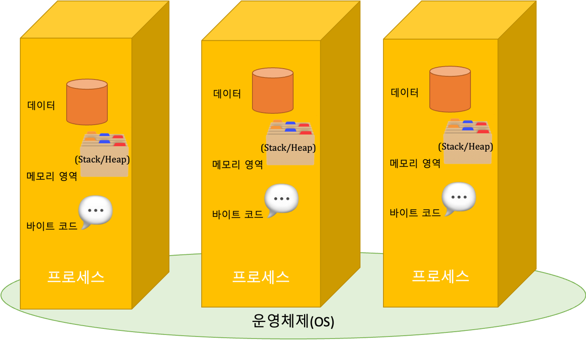
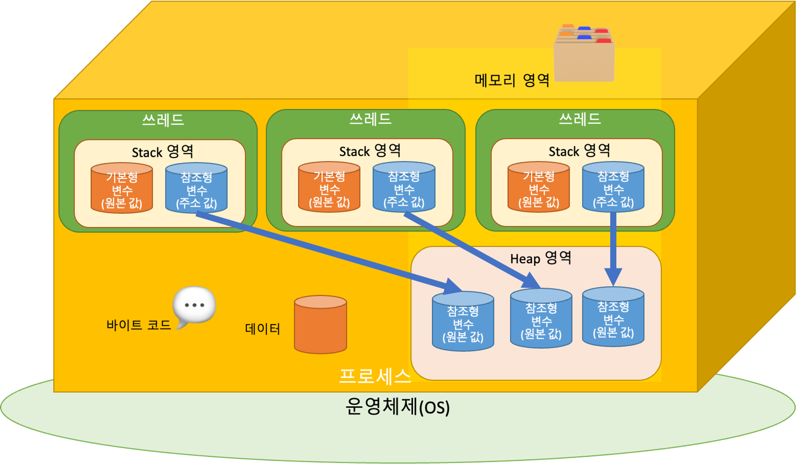
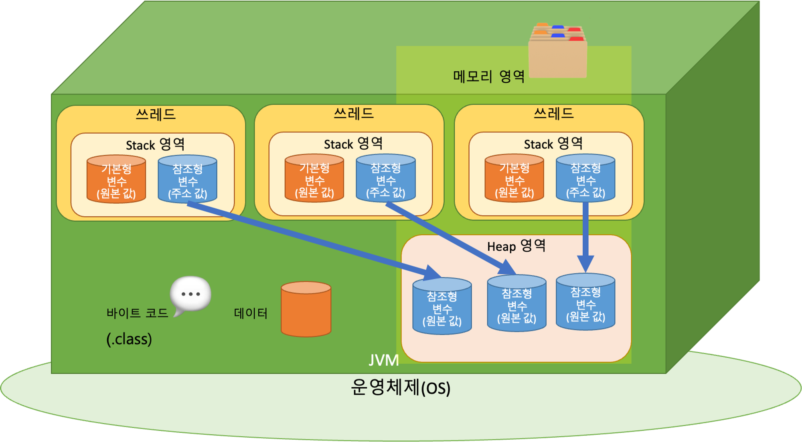
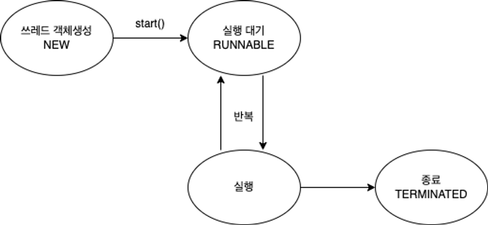
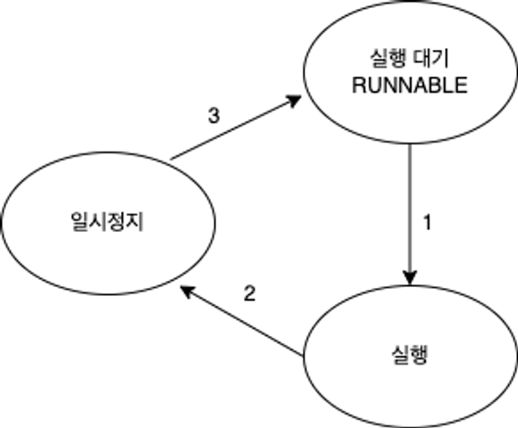
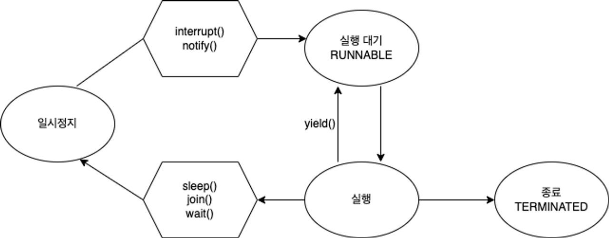

# 프로세스와 쓰레드

<aside>
📌 Process vs Thread

</aside>

- 프로세스 : 운영체제로 부터 자원을 할당받는 작업의 단위
- 쓰레드 : 프로세스가 할당받은 자원을 이용하는 실행의 단위


즉, 하나 하나 크게 봐서 프로그램들을 프로세스라고 하고, 그 안에 실행되는 것들을 쓰레드라고 합니다.

<aside>
📌 OS가 프로그램 실행을 위한 프로세스를 할당 해줄떄 프로세스 안에 프로그램 Code와 Data 그리고 Memory Area(Stack, Heap)을 함께 할당해줍니다.

</aside>

- Code는 Java main 과 같은 코드를 말합니다.
- Data는 프로그램이 실행 중 저장할 수 있는 저장공간을 말합니다.
    - 전역, 정적, 배열 등 초기화된 데이터를 저장하는 공간
- Memory Area
    - Stack : 지역변수, 매개변수 리턴 변수를 저장하는 공간
    - Heap : 프로그램이 동적으로 필요한 변수를 저장하는 공간(new(), mallok())



## Thread

쓰레드는 프로세스 내에서 일하는 일꾼으로, 코드 실행의 흐름이라고 생각할 수 있습니다.

- **쓰레드의 자원**
    - 프로세스 안에는 여러 쓰레드들이 있고, 쓰레드들은 실행을 위한 프로세스 내 주소공간이나 Heap을 공유 받습니다.
    - 추가로, 쓰레드들은 각각 명령처리를 위한 자신만의 메모리 공간도 할당 받습니다.



---

<aside>
📌 일반 쓰레드와 동일하며 JVM 프로세스 안에서 실행되는 쓰레드를 Java Thread라고 합니다.

</aside>

- Java를 실행하면 JVM 프로세스 위에서 실행이 됩니다.



### 멀티 쓰레드(← → 싱글 쓰레드)

Java는 메인 쓰레드가 Main() 메서드를 실행시키면서 시작이 됩니다.

- 메인 쓰레드는 필요에 따라서 작업 쓰레드를 생성해서 병렬로 코드를 실행 시킬 수 있습니다.
- 즉, Multi Thread 를 지원합니다.

1. Single Thread

<aside>
📌 프로세스 안에서 하나의 쓰레드만 실행되는 것을 말합니다.

</aside>

- Java의 경우 `main()` 메서드만 실행시켰을 때 Single Thread라고 합니다.
- 그래서, 프로그램이 종료가 될 경우 Main Thread가 종료되는 것이고, JVM도 같이 종료가 됩니다.

```java
public class Main {
    public static void main(String[] args) {
        Runnable task = () -> {
        	  System.out.print("2번 -> " + Thread.currentThread().getName());
            for (int i = 0; i < 100; i++) {
                System.out.print("$");
            }
        };

				System.out.print("1번 -> " + Thread.currentThread().getName());
        Thread thread1 = new Thread(task);
        thread1.setName("thread1");

        thread1.start();
    }
}
```

위의 코드를 분석하면, 1번의 `main` 쓰레드가 먼저 실행되고, 그에 따라 Thread1 이 실행되는 결과를 확인 할 수 있습니다.

1. Multi Thread

<aside>
📌 프로세스 안에서 여러개의 쓰레드가 실행되는 것을 말합니다.

</aside>

- 하나의 프로세스는 여러개의 실행단위(쓰레드)를 가질 수 있으며 이 쓰레드들은 프로세스의 자원을 공유합니다.
- Java는 main Thread외에 다른 작업을 생성하여 동시 다발적인 실행 흐름을 만들 수 있습니다.
- Multi Thread 장점
    - 동시 다발적인 실행으로 처리 속도가 빨라집니다.
    - 스택을 제외한 모든 영역에서 메모리를 공유하기 때문에 자원을 보다 효율적으로 사용할 수 있습니다.
- 단점
    - 동기화 문제가 발생할 수 있습니다.
        - 프로세스의 자원을 공유 하면서 작업을 처리하기 때문에 충돌하여, Dead Lock 이 발생할 수 있습니다. (서로 점유하고 있는 Resource를 내놓을 때 까지 기다리는 시간이 무한대로 늘어나 교착상태가 지속되는 것을 Dead Lock 이라고 합니다.)
        - 이러한 충돌은, 우리가 프로세스의 실행시간을 예측할 수 없기 때문에 발생할 수 있는 문제중 하나 입니다. 즉, OS의 상황에 따라 가변적으로 변하게 됨을 알 수 있습니다.

```java
Runnable task = () -> {
            for (int i = 0; i < 100; i++) {
                System.out.print("$");
            }
        };
        Runnable task2 = () -> {
            for (int i = 0; i < 100; i++) {
                System.out.print("*");
            }
        };

        Thread thread1 = new Thread(task);
        thread1.setName("thread1");
        Thread thread2 = new Thread(task2);
        thread2.setName("thread2");

        thread1.start();
        thread2.start();
    }
```

- 실제 구현

```java
public class Main{
	public static void main(String args[]){
	  // 이런식으로 Thread를 extends한 클래스를 인스턴스화 시켜서 내부의 
	  // `run()`을 구현한 동작을 실행 시킵니다.
		TestThread thread = new TestThread();
		thread.start();
	}
}
```

```java
public class Main{
	public static void main(String args[]){
	  // 이런식으로 Runnable를 implements한 클래스를 인스턴스화 시켜서 내부의 
	  // `run()`을 구현한 동작을 실행 시킵니다.
		Runnable thread = new TestRunnable();
		thread.start();
	}
}
```

```java
public class Main{
	public static void main(String args[]){
	  // 이런식으로 Runnable를 implements한 클래스를 인스턴스화 시켜서 내부의 
	  // `run()`을 구현한 동작을 실행 시킵니다.
		Runnable task = () -> {
			int sum = 0;
			for(int i = 0; i < 50; i++){
				sum+=i;
				System.out.println(sum);
			}
			System.out.println(Thread.currentThread().getName() + " 최종 합 : " + sum);
		}
	}
}
```

마지막의 `lambda` 의 방식으로 가장 많이 사용하기 때문에 이러한 방식에 대해서 익숙해질 필요가 있습니다. 이러한, task를 동시에 여러개의 Thread에 실해을 하게 되면 출력 값이 섞여서 나오는 것을 확인 할 수 있습니다.

---

## Demon & User Thread

### Demon Thread

<aside>
📌 보이지 않는곳(background)에서 실해오디는 낮은 우선순위를 가진 쓰레드를 말합니다.

</aside>

- 보조적인 역할을 담당하며 대표적인 데몬 쓰레드로는 메모리 영역을 정리해주는 GBC(Garbage Collector)가 있습니다.
- 설정 방법

```java
public class Main {
    public static void main(String[] args) {
        Runnable demon = () -> {
            for (int i = 0; i < 1000000; i++) {
                System.out.println("demon");
            }
        };

        // 다른 쓰레드에 비해 리소스를 적게 할당 받기 때문에 상대적으로 느리게 실행이 됩니다.
        Thread thread = new Thread(demon);
        thread.setDaemon(true); // true로 설정시 데몬스레드로 실행됨

        thread.start();

        for (int i = 0; i < 100; i++) {
            System.out.println("task");
        }
    }
}
```

이런, Demon Thread는 쓰레드가 다 끝날 때 까지 기다려지는 것이 아니라 어느정도 시간이 지나면 끝나게 됩니다. 그리고, 이렇게 Demon Thread를 제외한 우리가 만든 쓰레드들을 `User Thread` 라고 합니다.

### 우선순위와 쓰레드 그룹

<aside>
📌 쓰레드 작업의 중요도에 따라서 쓰레드의 우선순위를 부여할 수 있습니다.

</aside>

위의 우선순위를 주어서, 작업 시간을 할당해 급한 것을 먼저 처리하는 방식을 할 수 있습니다.

- 우선순위는 아래와 같이 3가지로 나뉩니다.
    - MAX_PRIORITY = 10
    - MIN_PRIORITY = 1
    - NROM_PRIORITY = 5
        - 기본 값이 보통 우선순위 입니다.
    - 이 우선순위의 범위는 OS가 아니라 JVM에서 설정한 우선순위입니다.

```java
Thread thread1 = new Thread();
thread1.setPriority(8);
```

- 쓰레드 그룹은 말 그대로, 메인 쓰레드 안의 다양한 쓰레드를 특징마다 묶어서 관리하기 위해 생기게 되었습니다.
    - 모든 쓰레드는 반드시 하나의 그룹에 포함되어 있어야 합니다.

```java
public class Main {
    public static void main(String[] args) {
        Runnable task = () -> {
            while (!Thread.currentThread().isInterrupted()) {
                try {
                    Thread.sleep(1000);
                    System.out.println(Thread.currentThread().getName());
                } catch (InterruptedException e) {
                    break;
                }
            }
            System.out.println(Thread.currentThread().getName() + " Interrupted");
        };

        // ThreadGroup 클래스로 객체를 만듭니다.
        ThreadGroup group1 = new ThreadGroup("Group1");

        // Thread 객체 생성시 첫번째 매개변수로 넣어줍니다.
        // Thread(ThreadGroup group, Runnable target, String name)
        Thread thread1 = new Thread(group1, task, "Thread 1");
        Thread thread2 = new Thread(group1, task, "Thread 2");

        // Thread에 ThreadGroup 이 할당된것을 확인할 수 있습니다.
        System.out.println("Group of thread1 : " + thread1.getThreadGroup().getName());
        System.out.println("Group of thread2 : " + thread2.getThreadGroup().getName());

        thread1.start();
        thread2.start();

        try {
            // 현재 쓰레드를 지정된 시간동안 멈추게 합니다.
            Thread.sleep(5000);
        } catch (InterruptedException e) {
            e.printStackTrace();
        }

        // interrupt()는 일시정지 상태인 쓰레드를 실행대기 상태로 만듭니다.
        group1.interrupt();

    }
}
```

---

## 쓰레드 상태와 제어

<aside>
📌 우리는 동영상을 보거나 음악을 듣고 있을 때 일시정지 후에 다시 보거나 듣기도 하고 중간에 종료 시키기도 합니다. 쓰레드도 마찬가지로 상태가 존재하고 이를 제어를 할 수 있습니다.

</aside>

## 쓰레드 상태



- 이처럼 쓰레드는 실행과 대기를 반복하며 `run()` 메서드를 수행합니다.
- 메서드가 종료되면 `run()` method도 또한 종료됩니다.

---



- 일시정지 상태에서는 쓰레드가 실행을 할 수 없는 상태가 됩니다.

<aside>
📌 아래는 쓰레드의 상태를 정리한 표입니다.

| 상태 | Enum | 설명 |
| --- | --- | --- |
| 객체생성 | NEW | 쓰레드 객체 생성, 아직 start() 메서드 호출 전의 상태 |
| 실행대기 | RUNNABLE | 실행 상태로 언제든지 갈 수 있는 상태 |
| 일시정지 | WAITING | 다른 쓰레드가 통지(notify) 할 때까지 기다리는 상태 |
| 일시정지 | TIMED_WAITING | 주어진 시간 동안 기다리는 상태 |
| 일시정지 | BLOCKED | 사용하고자 하는 객체의 Lock이 풀릴 때까지 기다리는 상태 |
| 종료 | TERMINATED | 쓰레드의 작업이 종료된 상태 |
</aside>

---

## 쓰레드 제어



### Sleep(), interupt()

1. sleep() : 현재 쓰레드를 지정된 시간동안 멈추게 합니다. - TIMED-WAITING

```java
public class Main {
    public static void main(String[] args) {
        Runnable task = () -> {
            try {
		            // (1) 예외처리 필수! 
		            // - interrunpt() 를 만나면 다시 실행되기 때문에
		            // - interruptedException이 발생할 수 있다.
		            // (2) 특정 쓰레드 지목 불가
                Thread.sleep(2000); // TIMED_WAITING
            } catch (InterruptedException e) {
                e.printStackTrace();
            }
            System.out.println("task : " + Thread.currentThread().getName());
        };

        Thread thread = new Thread(task, "Thread");
        thread.start();

        try {
		        // 1초가 지나고 나면 runnable 상태로 변하여 다시 실행됩니다.
		        // 특정 스레드를 지목해서 멈추게 하는 것은 불가능합니다.
		        //
            thread.sleep(1000); // static method이기 때문에 main thread와 같은 동작을 합니다.
            System.out.println("sleep(1000) : " + Thread.currentThread().getName());
        } catch (InterruptedException e) {
            e.printStackTrace();
        }
    }
}
```

`Thread.sleep()`  메서드 자체가 static으로 선언이 되어 있기 때문에 특정 부분에 대해서 sleep을 하는 것이 아니라, 쓰레드 자체에 시간을 일정 입력한 시간동안 멈추게 하는 것임을 알 수 있습니다. 또한 `try-catch` 로 감싸준 이유는 해당 `sleep()` 메서드는 throws InterruptedException을 반환하여 위험한 메서드임을 알려주고 있기 때문에 감싸주고 있는 것입니다.

1. Interrupt() : 일시정지 상태인 쓰레드를 실행대기 상태로 만듭니다.

```java
public class Main {
    public static void main(String[] args) {
        Runnable task = () -> {
            try {
                Thread.sleep(1000);
                System.out.println(Thread.currentThread().getName());
            } catch (InterruptedException e) {
                e.printStackTrace();
            }
            System.out.println("task : " + Thread.currentThread().getName());
        };

        Thread thread = new Thread(task, "Thread");
        thread.start(); // NEW -> Runnable로 가서 실행이 됩니다.

        thread.interrupt(); // 스레드를 실행대기 상태를 방해하고 catch문으로 빠지게 만듭니다.

        System.out.println("thread.isInterrupted() = " + thread.isInterrupted());

    }
}
```

```java
public class Main {
    public static void main(String[] args) {
        Runnable task = () -> {
            while (!Thread.currentThread().isInterrupted()) {
                try {
                    Thread.sleep(1000);
                    System.out.println(Thread.currentThread().getName());
                } catch (InterruptedException e) {
                    break;
                }
            }
            System.out.println("task : " + Thread.currentThread().getName());
        };

        Thread thread = new Thread(task, "Thread");
        thread.start();

        thread.interrupt();

        System.out.println("thread.isInterrupted() = " + thread.isInterrupted());
        
    }
}
```

1. **Join()**

<aside>
📌 정해진 시간 동안 지정한 쓰레드가 작업하는 것을 기다립니다.

- 시간을 지정하지 않았을 때는 지정한 쓰레드의 작업이 끝날 때까지 기다립니다.
</aside>

- `join()`  사용방법

```java
Thread thread = new Thread(task, "thread");

thread.start();

try {
    thread.join();
} catch (InterruptedException e) {
    e.printStackTrace();
}
```

- `Thread.sleep(ms);` ms(밀리초) 단위로 설정됩니다.
- 예외 처리를 해야 합니다.
    - `**interrupt()` 를 만나면 기다리는 것을 멈추기 때문에 InterruptedException이 발생할 수 있습니다.**
- **시간을 따로 지정하지 않았기 때문에 thread가 작업이 끝날 때까지 main 쓰레드는 기다리게 됩니다.**

```java
public class Main {
    public static void main(String[] args) {
        Runnable task = () -> {
            try {
                Thread.sleep(5000); // 5초
            } catch (InterruptedException e) {
                e.printStackTrace();
            }
        };

        Thread thread = new Thread(task, "thread");

        thread.start();

        long start = System.currentTimeMillis();

        try {
            thread.join();

        } catch (InterruptedException e) {
            e.printStackTrace();
        }

        // thread 의 소요시간인 5000ms 동안 main 쓰레드가 기다렸기 때문에 5000이상이 출력됩니다.
        System.out.println("소요시간 = " + (System.currentTimeMillis() - start));
    }
}
```

1. yield()

<aside>
📌 남은 시간을 다음 쓰레드에게 ***양보***하고 쓰레드 자신은 실행 대기 상태가 됩니다.

</aside>

- `yield()`  사용방법

```java
public class Main {
    public static void main(String[] args) {
        Runnable task = () -> {
            try {
                for (int i = 0; i < 10; i++) {
                    Thread.sleep(1000);
                    System.out.println(Thread.currentThread().getName());
                }
            } catch (InterruptedException e) {
                Thread.yield(); // thread1의 resource가 5초뒤에 thread2로 양도됩니다.
            }
        };

        Thread thread1 = new Thread(task, "thread1");
        Thread thread2 = new Thread(task, "thread2");

        thread1.start();
        thread2.start();

        try {
            Thread.sleep(5000);
        } catch (InterruptedException e) {
            e.printStackTrace();
        }

        thread1.interrupt(); // 실행대기 상태로 만든다.

    }
}
```

- thread1 와 thread2가 같이 1초에 한 번씩 출력되다가 5초 뒤에 thread1에서 InterruptedException이 발생하면서 `Thread.yield()` 이 실행되어 thread1은 실행 대기 상태로 변경되면서 남은 시간은 thread2에게 리소스가 양보됩니다.

```java
public class Main {
    public static void main(String[] args) {
        Runnable task = () -> {
            try {
                for (int i = 0; i < 10; i++) {
                    Thread.sleep(1000);
                    System.out.println(Thread.currentThread().getName());
                }
            } catch (InterruptedException e) {
                Thread.yield();
            }
        };

        Thread thread1 = new Thread(task, "thread1");
        Thread thread2 = new Thread(task, "thread2");

        thread1.start();
        thread2.start();

        try {
            Thread.sleep(5000);
        } catch (InterruptedException e) {
            e.printStackTrace();
        }

        thread1.interrupt();

    }
}
```

1. synchronized()

    <aside>
    📌 멀티 쓰레드의 경우 여러 쓰레드가 한 프로세스의 **자원을 공유**해서 작업하기 때문에 서로에게 영향을 줄 수 있습니다. 이로 인해서 장애나 버그가 발생할 수 있습니다.

    - 이러한 일을 방지하기 위해(자원을 공유하다가 생길 수 있는 오류) 한 **쓰레드가 진행중인 작업을 다른 쓰레드가 침범하지 못하도록 막는 것**을 `Thread Synchronized` 라고 합니다.
    - 동기화를 하려면 다른 쓰레드의 침범을 막아야 하는 코드들을 `임계 영역` 으로 설정하면 됩니다.
    </aside>

    - `synchronized` 를 사용한 동기화
        - 실행할 **메서드 또는 실행할 코드 묶음 앞에 synchronized를 붙여**서 임계 영역을 지정하여 다른 쓰레드의 침범을 막을 수 있습니다.(침범을 막다 = Lock을 거는 것 입니다.)
        - 임계 영역 지정
            - 메서드 전체를 임계 영역으로 지정합니다.

            ```java
            public synchronized void asyncSum() {
            	  ...침범을 막아야하는 코드...
            }
            ```

            - 특정 영역을 임계 영역으로 지정합니다.

            ```java
            synchronized(해당 객체의 참조변수) {
            		...침범을 막아야하는 코드...
            }
            ```

    - `synchronized` 사용 방법
        - `synchronzied`  없을 때

        ```java
        남은 사과의 수가 뒤죽박죽 출력될 뿐만 아니라 없는 사과를 먹는 경우도 발생합니다.
        ```

        ```java
        public class Main {
            public static void main(String[] args) {
                AppleStore appleStore = new AppleStore();
        
                Runnable task = () -> {
                    while (appleStore.getStoredApple() > 0) {
                        appleStore.eatApple();
                        System.out.println("남은 사과의 수 = " + appleStore.getStoredApple());
                    }
        
                };
        
                for (int i = 0; i < 3; i++) {
                    new Thread(task).start();
                }
            }
        }
        
        class AppleStore {
            private int storedApple = 10;
        
            public int getStoredApple() {
                return storedApple;
            }
        
            public void eatApple() {
                if (storedApple > 0) {
                    try {
                        Thread.sleep(1000);
                    } catch (InterruptedException e) {
                        e.printStackTrace();
                    }
                    storedApple -= 1;
                }
            }
        }
        ```

        - `synchronized` 있을 때

        ```java
        public class Main {
            public static void main(String[] args) {
                AppleStore appleStore = new AppleStore();
        
                Runnable task = () -> {
                    while (appleStore.getStoredApple() > 0) {
                        appleStore.eatApple();
                        System.out.println("남은 사과의 수 = " + appleStore.getStoredApple());
                    }
        
                };
        
                for (int i = 0; i < 3; i++) {
                    new Thread(task).start();
                }
            }
        }
        
        class AppleStore {
            private int storedApple = 10;
        
            public int getStoredApple() {
                return storedApple;
            }
        
            public void eatApple() {
                synchronized (this) {
                    if(storedApple > 0) {
                        try {
                            Thread.sleep(1000);
                        } catch (InterruptedException e) {
                            e.printStackTrace();
                        }
                        storedApple -= 1;
                    }
                }
            }
        }
        ```

    1. wait() / notify()

    <aside>
    📌 침범을 막은 코드를 수행하다가 작업을 더 이상 진행할 상황이 아니면, `wait()`  을 호출하여 쓰레드가 Lock을 반납하고 기다리게 할 수 있습니다.

    </aside>

    - 그럼 다른 쓰레드가 락을 얻어 해당 객체에 대한 작업을 수행할 수 있게 되고, 후에 작업을 진행할 수 있는 상황이 되면 호출해 다시 Lock을 얻어 진행 가능
    1. `wait()` : 실행 중이던 쓰레드는 해당 객체의 waiting pool에서 통지를 기다립니다.
    2. `notify()` : 해당 객체의 waiting pool 에 있는 모든 쓰레드 중에서 임의의 쓰레드만 통지를  받습니다.

    ```java
    public class Main {
        public static String[] itemList = {
                "MacBook", "IPhone", "AirPods", "iMac", "Mac mini"
        };
        public static AppleStore appleStore = new AppleStore();
        public static final int MAX_ITEM = 5;
    
        public static void main(String[] args) {
    
            // 가게 점원
            Runnable StoreClerk = () -> {
                    while (true) {
    		                // 0 ~ 4까지 랜덤한 숫자 출력
                        int randomItem = (int) (Math.random() * MAX_ITEM);
                        // restock 은 제고를 넣는 메서드라고 할 수 있습니다. 
                        appleStore.restock(itemList[randomItem]);
                        try {
                            Thread.sleep(50);
                        } catch (InterruptedException ignored) {
                        }
                    }
            };
    
            // 고객
            Runnable Customer = () -> {
                    while (true) {
                        try {
                            Thread.sleep(77);
                        } catch (InterruptedException ignored) {
                        }
    
                        int randomItem = (int) (Math.random() * MAX_ITEM);
                        appleStore.sale(itemList[randomItem]);
                        System.out.println(Thread.currentThread().getName() + " Purchase Item " + itemList[randomItem]);
                    }
            };
    
            new Thread(StoreClerk, "StoreClerk").start();
            new Thread(Customer, "Customer1").start();
            new Thread(Customer, "Customer2").start();
    
        }
    }
    
    class AppleStore {
        private List<String> inventory = new ArrayList<>();
    
        public void restock(String item) {
            synchronized (this) {
                while (inventory.size() >= Main.MAX_ITEM) {
                    System.out.println(Thread.currentThread().getName() + " Waiting!");
                    try {
                        wait(); // 재고가 꽉 차있어서 재입고하지 않고 기다리는 중!
                        Thread.sleep(333);
                    } catch (InterruptedException e) {
                        e.printStackTrace();
                    }
                }
                // 재입고
                inventory.add(item);
                notify(); // 재입고 되었음을 고객에게 알려주기
                System.out.println("Inventory 현황: " + inventory.toString());
            }
        }
    
        public synchronized void sale(String itemName) {
            while (inventory.size() == 0) {
                System.out.println(Thread.currentThread().getName() + " Waiting!");
                try {
                    wait(); // 재고가 없기 때문에 고객 대기중
                    Thread.sleep(333);
                } catch (InterruptedException e) {
                    e.printStackTrace();
                }
            }
    
            while (true) {
                // 고객이 주문한 제품이 있는지 확인
                for (int i = 0; i < inventory.size(); i++) {
                    if (itemName.equals(inventory.get(i))) {
                        inventory.remove(itemName);
                        notify(); // 제품 하나 팔렸으니 재입고 하라고 알려주기
                        return; // 메서드 종료
                    }
                }
    
                // 고객이 찾는 제품이 없을 경우
                try {
                    System.out.println(Thread.currentThread().getName() + " Waiting!");
                    wait();
                    Thread.sleep(333);
                } catch (InterruptedException e) {
                    e.printStackTrace();
                }
            }
    
        }
    }
    ```

    1. Lock()

    <aside>
    📌 synchronized 블럭으로 동기화하면 자동적으로 lock 이 걸리고 풀리지만, 같은 메서드 내에서만 lock을 걸 수 있다는 제약이 있습니다.

   이런 제약을 해결 하기 위해 Lock 클래스를 사용합니다.

    </aside>

    - ReentrantLock
        - 재진입 가능한 Lock, 가장 일반 적인 Lock
        - 특정 조건에서 Lock을 풀고, 나중에 다시 얻어 임계영역으로 진입이 가능

        ```java
        public class MyClass {
            private Object lock1 = new Object();
            private Object lock2 = new Object();
            
            public void methodA() {
                synchronized (lock1) {
                    methodB();
                }
            }
            
            public void methodB() {
                synchronized (lock2) {
                    // do something
                    methodA();
                }
            }
        }
        ```

      이때, 해당 락을 사용하면, 같은 스레드가 같은 락을 가지고 있어도 유지하며 계속 실행 할 수 있게 합니다.

    - ReentrantReadWriteLock
        - 읽기를 위한 Lock과 쓰기를 위한 Lock을 따로 제공합니다.
        - 일기에는 공유적이고, 쓰기에는 베타적인 Lock입니다.
        - 읽기 lock이 걸려있으면 다른 쓰레드들도 읽기 Lock을 중복으로 걸고 읽기를 수행할 수 있습니다.(read-only and 데이터 변경 방지)
    - StampedLock : 사용할때만 락을 건다!


    📌 wait() & notify()의 문제점인 waiting pool 내 쓰레드를 구분하지 못한다는 것을 해결한 것이 Condition입니다.

```java
public class Main {
public static final int MAX_TASK = 5;

private ReentrantLock lock = new ReentrantLock();

// lock으로 condition 생성
private Condition condition1 = lock.newCondition();
private Condition condition2 = lock.newCondition();

private ArrayList<String> tasks = new ArrayList<>();

// 작업 메서드
public void addMethod(String task) {
			lock.lock(); // 임계영역 시작
	
			try {
				while(tasks.size() >= MAX_TASK) {
						String name = Thread.currentThread().getName();
						System.out.println(name+" is waiting.");
						try {
							condition1.await(); // wait(); condition1 쓰레드를 기다리게 합니다.
							Thread.sleep(500);
						} catch(InterruptedException e) {}	
				}
	
				tasks.add(task);
				condition2.signal(); // notify();  기다리고 있는 condition2를 깨워줍니다.
				System.out.println("Tasks:" + tasks.toString());
			} finally {
				lock.unlock(); // 임계영역 끝
			}
		}
	}
```
   
   